# golem

<p align="center">
  
</p>

<p>
  <a href="LICENSE"></a>
  
  
  
  
  <a href="https://www.repostatus.org/#active"></a>
</p>

> **An @enchanter-ai product — thin, hardened, and loud when something's wrong.**

**Define and evaluate expressions in Python — a compiled Go core does the work, invisibly. No Go toolchain, no silent zeros.**

You write a formula in Python. golem compiles it once, caches it, and evaluates it at near-native speed against your data. A typo becomes an error you can read, not a `0` that quietly poisons a result.

> A data scientist defines a computed metric in a Python notebook:
> `revenue * margin - fixed_cost`.
>
> ```python
> import golem
> e = golem.Engine(variables={"revenue": 0.0, "margin": 0.0, "fixed_cost": 0.0})
> e.eval("revenue * margin - fixed_cost", {"revenue": 1200.0, "margin": 0.31, "fixed_cost": 90.0})  # => 282.0
> ```
>
> She never installs Go and never sees a goroutine — `pip install enchanter-golem`
> shipped a prebuilt wheel with the compiled Go engine baked in. When she
> fat-fingers `margn` in a sibling formula, golem fails it **immediately** with
> *did you mean "margin"?* instead of silently returning `0`. The same engine that
> answers her notebook is the one a Go service runs on its hot path — one core, one
> answer, no parity drift.
>
> Zero silent-zeros. Zero parser code written.

## TL;DR

**In plain English:** You define a formula in Python — a computed metric, a feature, a pricing rule. golem turns a typo'd variable into a readable *error* instead of a silent `0`, runs the formula in a compiled Go engine at roughly a microsecond, and ships as a prebuilt wheel so you never touch the Go toolchain. A Go service can embed the very same engine and get the very same answer.

**Technically:** golem is a thin wrapper over [`expr-lang/expr`](https://github.com/expr-lang/expr). The **primary interface is Python**, which loads a CGo `c-shared` native library (`libgolem`) over the Go core via [`cffi`](https://cffi.readthedocs.io/) in ABI mode and ships as prebuilt wheels; the Go core remains directly embeddable by Go services. It compiles each expression once into an immutable, thread-safe `*vm.Program`, caches it in a bounded `hashicorp/golang-lru/v2`, and adds the production layer expr leaves to the caller: a 7-type error API (`errors.As`-switchable), strict `expr.Env` type-checking so an undeclared identifier is a **compile-time** `UndefinedVariableError`, a `safeRun` panic→error boundary, an AST-node cost budget, and a goroutine-raced eval timeout. The Python binding's C ABI is **string-only by design**, so dynamic data crosses as a type-tagged JSON envelope — there is no second evaluator and no parity drift.

## Origin

**golem** takes its name from **Thaumcraft** — a stone construct you inscribe with a **Seal** (an instruction) that then performs that instruction exactly and tirelessly, **powered by Vis**, the mod's magical essence. This package runs its *expression* exactly and tirelessly, millions of times per second, powered by [`vis`](../vis) — the @enchanter-ai behavioral substrate every sibling consumes. A golem does precisely what its seal says, so when the result is wrong, the *seal* was wrong. That is the whole product: it does exactly what you **wrote**, and fails loud when what you wrote is the problem.

The question this product answers: *Did it compute what I meant — or silently return 0?*

## Who this is for

- **Data scientists, analysts, and Python authors** who know Python and want to define and evaluate formulas — computed metrics, features, pricing/risk rules, ETL transforms — without learning Go, installing a toolchain, or worrying about a typo silently becoming `0`. `pip install enchanter-golem` and `import golem`; the Go engine is invisible.
- Teams who want a typo to fail with a **readable error**, not silently become `0` in a live result.
- Go-service embedders (secondary) who need the **same engine and the same answer** the Python authors use — golem's Go core is directly importable for hot-path use.

Not for:

- A one-off in-process calculation — `strconv` + a `switch` is enough; golem is overkill.
- Untrusted **arbitrary code execution** / a Turing-complete scripting engine — golem is non-Turing-complete *by design* (that is the safety guarantee).
- Rules-**workflow** orchestration (state machines, retries, scheduling) — golem evaluates an expression; it is not a workflow engine.

## Contents

- [How It Works](#how-it-works)
  - [Supported expressions](#supported-expressions)
- [What Makes golem Different](#what-makes-golem-different)
- [Install](#install)
- [Quickstart](#quickstart)
- [Public API](#public-api)
- [vs Other Go Expression Libraries](#vs-other-go-expression-libraries)
- [Thread-safety](#thread-safety)
- [Null / undefined policy](#null--undefined-policy)
- [Numeric model & typed errors](#numeric-model--typed-errors)
- [Performance](#performance)
- [Using golem from Python (the primary interface)](#using-golem-from-python-the-primary-interface)
- [Why wrap, not build?](#why-wrap-not-build)
- [Agent Conduct](#agent-conduct)
- [Architecture](#architecture)
- [Dependency licenses](#dependency-licenses)
- [Acknowledgments](#acknowledgments)
- [Versioning & release cadence](#versioning--release-cadence)
- [Contributing](#contributing)
- [Citation](#citation)
- [License](#license)
- [Role in the ecosystem](#role-in-the-ecosystem)

## How It Works

golem doesn't parse expressions. expr does. golem **hardens** the path around expr so an authored expression is safe to run at scale and impossible to silently get wrong.

The core innovation is **compile-once, run-many**: every distinct expression is parsed and type-checked exactly once, then cached as an immutable, concurrency-safe compiled program. The hot path is `expr.Run` over a reused `*vm.Program`. Around that hot path golem layers three "by default"s:

- **Fast** — compile once, run many. A cache hit skips the parser, the type-checker, and the compiler entirely; the hot path is bytecode over a reused program.
- **Safe** — a sandboxed function/math allowlist, an AST-node cost budget, an evaluation timeout, and a panic→typed-error boundary. No expr-internal type ever leaks through the public API or an error message. (Custom Go functions you register run unsandboxed — see [SECURITY.md](SECURITY.md).)
- **Loud** — a typo'd or undeclared top-level variable is a **compile error**, not a silent zero. Variable schemas turn the "always evaluates to 0" failure class into a build-time failure.

North star: **zero silently-wrong evaluations in production.** No second evaluator, no parity drift between the Go and Python surfaces.

### Supported expressions

golem inherits the full `expr-lang/expr` grammar. An authored expression can use:

- **Arithmetic** — `+ - * /`, integer modulo `%`, and unary minus, with the usual precedence.
- **Parentheses** — explicit grouping, e.g. `2 + 3 * (x - 1)`.
- **Variable lookup** — named identifiers resolved against the declared schema, e.g. `revenue * margin`.
- **Common math** — a curated stdlib via `WithMathStdlib()` (`sqrt`, `abs`, `min`, `max`, `floor`, `ceil`, `round`, …).
- **Booleans & comparisons** — `true` / `false`, `== != < <= > >=`.
- **Logical operators** — `and` / `or` / `not` (and the `&& || !` spellings).
- **Ternary conditional** — `cond ? a : b`, e.g. `score > 0.8 ? "promote" : "hold"`.
- **Strings** — string literals, concatenation, comparison, and built-in string helpers.
- **Inline `let` bindings** — name a sub-result for reuse, e.g. `let t = a + b; t * t`.
- **Host functions** — Go-registered custom functions via `WithFunction(name, fn)`, e.g. `clamp(sqrt(area), 0, 100)`.
- **Null handling** — null-coalescing `??` and optional chaining `?.`, so a missing member resolves predictably instead of panicking.

A typo'd or undeclared **top-level** variable does not silently become `0` — it is a compile-time `UndefinedVariableError`. See [Null / undefined policy](#null--undefined-policy) for the strict-vs-lenient modes.

## What Makes golem Different

### It fails loud instead of returning a silent zero

A typo'd or undeclared top-level identifier is a **compile-time** `UndefinedVariableError` carrying a "did you mean" suggestion — not a `0` that silently poisons a live bid. The "always evaluates to 0" failure class becomes a build-time failure.

```go
e := golem.New(golem.WithVariables(golem.Vars{"revenue": 0.0}))
_, err := e.Compile("revenu * 2")
// *golem.UndefinedVariableError: undefined variable "revenu" (did you mean "revenue"?)
```

### It compiles once and runs the cache the rest of the time

Every distinct expression is parsed, type-checked, and compiled exactly once, then stored as an immutable `*vm.Program` in a bounded LRU. Subsequent evaluations are pure bytecode over the cached program — the hot path never touches the parser again.

### It gives Python and Go the same answer

The Python package — golem's primary interface — binds the **same Go core** through a CGo `c-shared` library (`libgolem`) loaded via `cffi`. There is no second evaluator and no parity drift: a float `2.0` authored in a Python notebook evaluates identically when a Go service embeds the core on its hot path.

### It speaks a 7-type error API, not a string

Every failure is one concrete, `errors.As`-switchable type (`ParseError`, `UndefinedVariableError`, `TypeMismatchError`, `EvalError`, `CostLimitError`, `TimeoutError`, `OverflowError`). No expr-internal type ever leaks through the boundary; the Python layer maps each to a same-named exception.

### It bounds cost and time

`WithCostLimit(n)` caps the AST node-visit budget (the **preferred** production guard); `WithEvalTimeout(d)` races `expr.Run` in a goroutine against a deadline (the secondary defense). Whichever fires first wins. An unbounded expression cannot stall the hot path.

### It is non-Turing-complete by design

golem evaluates an expression — it is not a scripting engine and cannot loop, recurse, or spawn. That is the safety guarantee, not a limitation: authored logic stays auditable and terminating.

## Install

### Python (the primary interface)

```sh
pip install enchanter-golem      # the import stays `import golem`
```

```python
import golem
```

`pip install enchanter-golem` is **fully self-contained.** Prebuilt binary wheels (manylinux / macOS x86+arm / Windows) are produced by CI via `cibuildwheel`, with the compiled Go core baked into each wheel as a native `c-shared` library (`libgolem`). The package's one runtime dependency, [`cffi`](https://cffi.readthedocs.io/), is pulled in automatically by pip. A Python user installs **nothing else** and **never needs Go or a C compiler** — the Go and C toolchains are used only at build time, inside CI. See [Using golem from Python](#using-golem-from-python-the-primary-interface) for the contract and limitations.

### Embedding the Go core directly (for Go services)

*(For Go developers embedding the engine in a Go service. **Python users can skip this entirely** — you never install Go.)*

The Go engine that Python runs on is also directly importable by Go services that want it in-process on a hot path:

```sh
go get github.com/enchanter-ai/golem
```

This Go-embedding path requires **Go 1.22+** (the floor required by `expr-lang/expr` v1.17.x). This Go requirement applies **only** to embedding the core in a Go service — it never applies to Python users, who install only the prebuilt wheel.

## Quickstart

### Python (start here)

The simplest possible thing: declare your variables, evaluate a formula.

```python
import golem

e = golem.Engine(variables={"x": 0.0})
print(e.eval("2 + 3 * (x - 1)", {"x": 5}))   # => 14
```

Booleans, ternaries, and strings work the way you'd expect:

```python
e = golem.Engine(variables={"status": "", "score": 0.0})
print(e.eval('status == "active" and score > 0.8 ? "promote" : "hold"',
             {"status": "active", "score": 0.91}))   # => "promote"
```

A computed-feature formula — declare each input once, then evaluate per row:

```python
e = golem.Engine(variables={"revenue": 0.0, "margin": 0.0, "fixed_cost": 0.0})
profit = "revenue * margin - fixed_cost"
print(e.eval(profit, {"revenue": 1200.0, "margin": 0.31, "fixed_cost": 90.0}))  # => 282.0
```

A typo fails loud instead of returning a silent `0`:

```python
e = golem.Engine(variables={"revenue": 0.0})
e.eval("revenu * 2", {"revenue": 100.0})
# raises UndefinedVariableError: undefined variable "revenu" (did you mean "revenue"?)
```

### Go (for embedders)

A Go service can embed the same engine in-process:

```go
package main

import (
	"fmt"

	"github.com/enchanter-ai/golem"
)

func main() {
	// x is declared float64 — its type drives the compile-time type-check.
	e := golem.New(golem.WithVariables(golem.Vars{"x": 0.0}))

	// Compile once; the program is cached and safe to reuse across goroutines.
	p, err := e.Compile("2 + 3 * (x - 1)")
	if err != nil {
		panic(err)
	}

	// int 5 is normalized to the declared float64 slot (numeric model, below).
	v, _ := p.Eval(golem.Vars{"x": 5})
	f, _ := v.AsFloat()
	fmt.Println(f) // => 14
}
```

Custom host functions and the curated math stdlib (Go-side):

```go
e := golem.New(
	golem.WithMathStdlib(),
	golem.WithFunction("clamp", func(x, lo, hi float64) float64 {
		return max(lo, min(x, hi))
	}),
)
e.Eval("clamp(sqrt(area), 0, 100)", vars)
```

## Public API

The whole surface is small on purpose: an `Engine` you configure once, a cached `Program` you reuse, and a `Value` with typed accessors.

| Symbol | Signature | What |
|--------|-----------|------|
| `New` | `New(opts ...Option) *Engine` | Build a configured, goroutine-safe engine; config is immutable after `New`. |
| `Compile` | `(e *Engine) Compile(src string) (*Program, error)` | Parse + type-check **once**; result is cached and returned as an immutable program. |
| `Eval` | `(e *Engine) Eval(src string, vars Vars) (Value, error)` | Compile-if-needed (cache-aware) then run in one call. |
| `Program.Eval` | `(p *Program) Eval(vars Vars) (Value, error)` | Run a cached program; safe for concurrent calls across goroutines. |
| Typed accessors | `EvalBool / EvalFloat / EvalInt / EvalString` | Run + assert result type in one call; wrong type → `TypeMismatchError`. |
| `Value` | `AsAny() any` · `AsBool/AsFloat/AsInt/AsString() (T, error)` | Result wrapper; `AsFloat` widens `int`→`float64`, `AsInt` rejects a true float. |

```go
type Vars map[string]any

func New(opts ...Option) *Engine
func (e *Engine) Compile(src string) (*Program, error) // parse + type-check once; cached
func (e *Engine) Eval(src string, vars Vars) (Value, error)

type Program struct{} // immutable; safe for concurrent Eval across goroutines
func (p *Program) Eval(vars Vars) (Value, error)
func (p *Program) EvalBool(vars Vars) (bool, error)
func (p *Program) EvalFloat(vars Vars) (float64, error)
func (p *Program) EvalInt(vars Vars) (int64, error)
func (p *Program) EvalString(vars Vars) (string, error)

type Value struct{} // AsAny() any; AsBool/AsFloat/AsInt/AsString() (T, error)
```

**Options:** `WithVariables(schema)`, `WithFunction(name, fn)`, `WithMathStdlib()`, `WithStrictVars(bool)`, `WithCacheSize(n)`, `WithEvalTimeout(d)`, `WithCostLimit(n)`.

## vs Other Go Expression Libraries

golem is not a new language — it is the **production layer** the Go expression ecosystem leaves to the caller.

| | golem | raw [`expr-lang/expr`](https://github.com/expr-lang/expr) | [`google/cel-go`](https://github.com/google/cel-go) | [`govaluate`](https://github.com/Knetic/govaluate) |
|---|---|---|---|---|
| Thin wrapper (no new language) | yes — wraps expr | n/a (is the engine) | own CEL language | own mini-language |
| Compile-once cache | bounded LRU, built in | manual (you cache) | manual (you cache) | manual |
| Typed error API | 7 `errors.As` types | string/expr-internal errors | CEL status errors | generic `error` |
| LOUD undefined-var (compile-time) | yes (`UndefinedVariableError` + "did you mean") | opt-in env, no suggestion | declared-var, verbose | runtime nil/error |
| Python binding (same core) | yes — `cffi` over one `c-shared` core | none | separate CEL-python impl | none |
| Thread-safe reusable program | yes (expr contract, documented) | yes (raw) | yes | not guaranteed |
| Cost + timeout guards | both, surfaced as options | cost only, no preemption | cost (interruptable) | none |

golem adds the bounded cache, the typed-error API, the loud-undefined-variable schema check, the panic boundary, the cost/timeout guards, and the single-core Python binding — none of which raw expr ships for you.

## Thread-safety

- An `*Engine` is **goroutine-safe**. Its program cache is a `*lru.Cache[string, *vm.Program]` from `hashicorp/golang-lru/v2`, which is intrinsically goroutine-safe — golem does **not** wrap it in an extra mutex (redundant double-locking). The resolved config is immutable after `New`.
- A `*Program` is **immutable** and safe for concurrent `Eval` from many goroutines: this is expr's documented contract — a compiled `*vm.Program` is reusable and thread-safe; only a raw `vm.VM` must not be shared, and golem never shares one.
- The program cache is **per-Engine**, keyed by the expression source string, never shared across Engines.

## Null / undefined policy

- **Strict by default** (`WithStrictVars(true)`): an undeclared **top-level** identifier is a compile-time `UndefinedVariableError`, carrying a "did you mean" suggestion drawn from the declared schema.
- **Lenient** (`WithStrictVars(false)`): sets expr's `AllowUndefinedVariables`, so undeclared variables resolve to `nil` at runtime instead of failing to compile.
- `??` (null-coalesce) and `?.` (optional chaining) are available in both modes.

**Caveat — nested map-key typos are NOT caught.** With a *map* environment, only top-level variable typos are caught at compile time; an unknown nested/member key (`obj.typo`) silently returns `nil`. A *struct* env would catch field typos too. Documented rather than hidden.

## Numeric model & typed errors

expr returns a Go `int` for integer arithmetic and `float64` for float arithmetic. golem makes the boundaries explicit:

- **`AsFloat()` / `EvalFloat()` widen `int`/`int64` → `float64`** — the *only* implicit result coercion, documented on purpose.
- **`AsInt()` / `EvalInt()` return a `TypeMismatchError` on a true float** — no silent truncation.
- **At Eval input**, golem normalizes numeric `Vars` to the declared schema type (e.g. an `int` input widens to `float64` when the schema declares `float64`). Numeric-only, explicit — **not** silent magic; a `float64` slot receiving a `string` is a `TypeMismatchError`.
- **Int-vs-float division is the #1 silent-zero trap.** In Go (and therefore expr) `5 / 2 == 2`, not `2.5`; make an operand a float (`5.0 / 2`) for float division. golem documents this rather than papering over it.

Every failure is one of these concrete types (`errors.As`-switchable; the Python layer maps each to a same-named exception):

| Error | Meaning |
|-------|---------|
| `ParseError` | malformed / syntactically invalid expression |
| `UndefinedVariableError` | undeclared top-level identifier in strict mode (carries name + "did you mean") |
| `TypeMismatchError` | compile-time type-check failure, un-coercible input, or wrong typed accessor |
| `EvalError` | runtime failure, including any recovered panic |
| `CostLimitError` | AST node-visit budget exceeded |
| `TimeoutError` | evaluation deadline exceeded |
| `OverflowError` | numeric overflow detected during evaluation |

**Cost & timeout guards.** `WithCostLimit(n)` is the **preferred** production guard (`n` = expr AST node-visit budget; exceed → `CostLimitError`). `WithEvalTimeout(d)` is the secondary defense: expr has **no VM-level preemption** (`expr.WithContext` only feeds a ctx into custom functions; it does not abort a running `Run`), so golem races `expr.Run` in a goroutine against the deadline and returns `TimeoutError` if the deadline wins — the abandoned goroutine runs until the expression returns, so long custom functions should poll a deadline `ctx`. If both are set, whichever fires first wins.

## Performance

The "millions of evaluations/sec, thread-safe" claim is about the **Go-native API**: a cached `*vm.Program` re-run via `expr.Run`. Cached evaluation runs in **low microseconds per eval — hardware-dependent** (on a throttled audit box it measured ~3942 ns/op; on warmer hardware it is closer to ~1 µs). The speedup over a cold parse + type-check + compile is large.

**Honest numbers:** real `ns/op` and `allocs/op` come from running the benchmarks on your hardware — they are not hand-typed here. Reproduce with:

```sh
go test -bench=. -benchmem ./...
```

The Python interface is native-fast *and* trivially installable, but pays a cffi + JSON-marshalling cost per call — fine, because Python is the authoring/product layer; a Go service that needs the absolute floor on latency embeds the core directly.

## Using golem from Python (the primary interface)

<a href="../../actions/workflows/wheels.yml"></a>

Python is how most people use golem: `pip install enchanter-golem`, `import golem`, define a formula, evaluate it. The install is **fully self-contained** — the compiled Go core is baked into the prebuilt wheel as a native `c-shared` library, and the lone runtime dependency, `cffi`, is pulled in automatically by pip; a Python user installs **nothing else** and **never needs Go or a C compiler**. Under the hood the Python package binds the **same Go core** that a Go service would embed — there is no second evaluator and no parity drift. CI compiles a tiny Go `package main` (in `python/capi`, behind build tag `golemcapi`) with `go build -buildmode=c-shared` into a native shared library (`libgolem.so` / `.dylib` / `.dll`); the Python package loads it via `cffi` in **ABI mode** — a runtime `dlopen`, so there is **no compilation at install time**. The Go core remains the in-process engine doing the work — it is simply invisible from Python.

```python
import golem

e = golem.Engine(variables={"x": 0.0})
print(e.eval("2 + 3 * (x - 1)", {"x": 5}))   # => 14
```

**How dynamic variables cross the boundary.** The C ABI is **string-only by design** — the Go `*Engine` never crosses it (engines are opaque integer handles), and no Go `error` crosses it either. Dynamic vars cross as a **JSON string** via `EvalJSON`, which returns a single self-describing envelope:

```json
{"ok": true,  "type": "int|float|bool|string|null", "value": <json>}
{"ok": false, "errtype": "ParseError|UndefinedVariableError|TypeMismatchError|EvalError|CostLimitError|TimeoutError|OverflowError", "error": "<msg>"}
```

The thin Python wrapper (over `cffi`) parses the envelope, restores the Python type from the `type` tag (so a float `2.0` stays a Python `float` even though JSON renders it `2`), and raises the mapped exception when `ok=false`. The symmetric `NewEngineJSON(optionsJSON)` carries the engine config (schema, strict flag, cache, cost, timeout) across the same way. The Go side keeps each engine in a handle registry, so all that crosses for the `Engine` itself is an opaque integer handle.

**Limitations (v1):** no Python callables as custom functions (Go-registered only; v2 roadmap); no collection results (slice/map → `EvalError`); NaN/Inf → `EvalError`; a `cffi` + JSON cost per call. The compiled `libgolem` library is not committed — `wheels.yml` builds it per platform with `go build -buildmode=c-shared` from `python/capi`; only `python/golem/__init__.py`, `python/golem/_ffi.py`, `python/capi/`, `pyproject.toml`, and `python/tests/` are checked in.

## Why wrap, not build?

*Don't reinvent the wheel.* A correct, fast, safe expression language needs a lexer, a Pratt/precedence parser, a type-checker, an operator table, a builtin library, and a bytecode VM — each a multi-month, bug-prone effort. `expr-lang/expr` ships all of it: MIT-licensed, fast, feature-complete (`??`, `?.`, `let`, ternaries, string/math builtins), with a documented thread-safe compiled-program model. golem stands on it and adds only the production layer it lacks.

**Precedent:** Google's **CEL-expr-python** (Mar 2026) wraps a compiled core with a thin Python skin for cross-language parity and automatic core-feature inheritance — the exact thesis behind golem. Full reasoning in the ADR ([`docs/adr/0001-why-wrap-not-build.md`](docs/adr/0001-why-wrap-not-build.md)). An **illustrative-only** reference parser ([`examples/reference-parser`](examples/reference-parser)) — a ~150-line Pratt parser — *shows* the work golem deliberately does not do; it is never imported.

**Why Go, not Rust / PyO3?** Bind the best-in-class evaluator. That's `expr-lang/expr` (Go): mature, MIT, fast, clean compile-once/run-many thread-safe contract. A Rust+PyO3 stack would mean either rewriting the evaluator (the exact anti-goal) or binding a weaker engine. There is no maturin-for-Go, so the wheel pipeline is `cibuildwheel` + glue — a deliberate, documented cost.

## Agent Conduct

golem is built and reasoned about under the same behavioral contract as every @enchanter-ai sibling: [`CLAUDE.md`](CLAUDE.md) `@`-imports the shared conduct modules from [`vis`](../vis), so an agent working in this repo acts deterministically, surgically, and verifiably — and reports honest numbers.

| Module | What it governs |
|--------|-----------------|
| [discipline.md](../vis/packages/core/conduct/discipline.md) | think-first, simplicity, surgical edits, goal-driven loops |
| [verification.md](../vis/packages/core/conduct/verification.md) | independent checks, baseline snapshots, dry-run for destructive ops |
| [verdict-calibration.md](../vis/packages/core/conduct/verdict-calibration.md) | every verdict (PASS/SHIP/VERIFIED) carries n + sampling method + a calibration qualifier |
| [failure-modes.md](../vis/packages/core/conduct/failure-modes.md) | the F-code failure taxonomy shared across the ecosystem |
| [tool-use.md](../vis/packages/core/conduct/tool-use.md) | tool-choice hygiene, error-payload contract, parallel-dispatch rules |

## Architecture

golem is a single Go core with a thin Python skin — the primary interface — over the *same* core. A caller — Python via the `cffi` binding, or a Go service embedding the core directly — enters through the public API (`Engine` / `Program`), which routes every evaluation through a fixed set of hardening layers before reaching the `expr-lang/expr` parser/checker/VM. The Python path differs only in that dynamic data crosses a type-tagged JSON envelope (`EvalJSON` / `NewEngineJSON`) into the identical Go core — there is no second evaluator.

<p align="center">
  
</p>

<sub>Diagram source: <a href="docs/assets/architecture.mmd">docs/assets/architecture.mmd</a> (rendered with mermaid-cli on a blueprint canvas).</sub>

### Compile-once / run-many flow

The first time an expression is seen it misses the cache, so golem pays the full parse + type-check + compile cost once and stores the resulting `*vm.Program`. Every subsequent evaluation of the same source is a cache hit and runs only `expr.Run` over the reused program — the hot path.

<p align="center">
  
</p>

<sub>Diagram source: <a href="docs/assets/compile-flow.mmd">docs/assets/compile-flow.mmd</a>.</sub>

## Dependency licenses

| Dependency | License | Note |
|------------|---------|------|
| [`expr-lang/expr`](https://github.com/expr-lang/expr) | **MIT** | the evaluation engine |
| [`hashicorp/golang-lru/v2`](https://github.com/hashicorp/golang-lru) | **MPL-2.0** | the bounded program cache — **MPL-2.0, NOT MIT**; a permissive file-level copyleft license, compatible with golem's MIT distribution |
| [`cffi`](https://cffi.readthedocs.io/) (Python runtime) | **MIT** | loads the bundled `libgolem` c-shared library; auto-installed by pip |
| [`cibuildwheel`](https://github.com/pypa/cibuildwheel) (build-time) | BSD-2-Clause | wheel builder |

golem itself is **MIT** (see [LICENSE](LICENSE)). Go and a C compiler are **build-time only** — used by CI to compile the wheels — and are never required to install or use the Python package.

## Acknowledgments

golem stands on substrate laid by others:

- **[expr-lang/expr](https://github.com/expr-lang/expr)** — the evaluation engine golem wraps.
- **[hashicorp/golang-lru](https://github.com/hashicorp/golang-lru)** — the bounded program cache.
- **[cffi](https://cffi.readthedocs.io/)** + **[cibuildwheel](https://github.com/pypa/cibuildwheel)** — the Python binding loader + wheel pipeline.
- **[Keep a Changelog](https://keepachangelog.com/)**, **[Semantic Versioning](https://semver.org/)**, **[Contributor Covenant](https://www.contributor-covenant.org/)**, **[repostatus.org](https://www.repostatus.org/)** — project conventions.

## Versioning & release cadence

golem follows [Semantic Versioning](https://semver.org/spec/v2.0.0.html). Breaking changes land on major bumps only; the [CHANGELOG](CHANGELOG.md) flags them explicitly. The Go module tag and the PyPI wheel version are cut from a single source so they never diverge. Release cadence is opportunistic — tags land when accumulated fixes or features justify a cut, not on a fixed schedule.

## Contributing

See [CONTRIBUTING.md](CONTRIBUTING.md). Security policy: [SECURITY.md](SECURITY.md).

## Citation

If you use this project in research or derivative work, please cite it:

```bibtex
@software{golem_2026,
  title  = {golem: a thin, hardened expression runtime for Go},
  author = {{Enchanter Labs}},
  year   = {2026},
  url    = {https://github.com/enchanter-ai/golem}
}
```

See [CITATION.cff](CITATION.cff) for additional formats (APA, MLA, EndNote).

## License

[MIT](LICENSE) © Enchanter Labs.

---

## Role in the ecosystem

golem is the **expression-evaluation primitive** of the @enchanter-ai stack — the deterministic layer that turns an authored expression into a trusted value. Its upstream dependency is [`vis`](../vis): golem consumes the shared conduct substrate and the honest-numbers / F-code contracts, so it is built the same way as every sibling.

Downstream, the agent products consume what golem evaluates: **wixie** can evaluate prompt-cost formulas through it; **robit** and **beholder** use it as a deterministic **guardrail / routing / policy** layer — gate a tool, validate an output, enforce a budget — *without* spending an LLM call on logic that is deterministic (the CEL-in-Envoy / k8s-admission pattern); and **pech** can express cost rules as golem expressions.

golem does not engineer prompts (wixie's lane), scan security surfaces (hydra's lane), review code (lich's lane), orchestrate git (sylph's lane), track tokens (emu's lane), or price dispatches (pech's lane). It evaluates an expression and guarantees it never silently lies — nothing more.

The AI/MLOps story is deliberately *adjacent*, never in the eval path: golem's hot path stays LLM-free forever (a model there would destroy latency, determinism, and safety). AI assistance lives off the hot path — NL→expression generation and a plain-English Explain Mode ("why is this 0? you wrote `revenu`, did you mean `revenue`?") — and an "MLOps *for* expressions" ops layer (versioning, lineage, drift detection) belongs in a separate sibling *above* golem, not inside it.

See [docs/ecosystem.md § Data Flow Between Plugins](docs/ecosystem.md#data-flow-between-plugins) for the full map.
